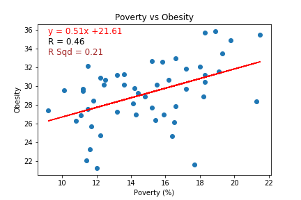
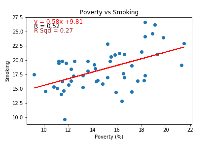
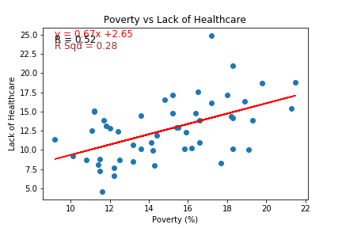
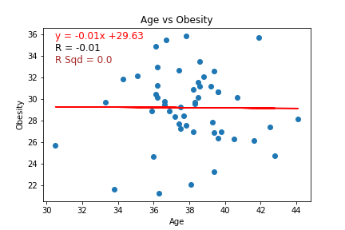
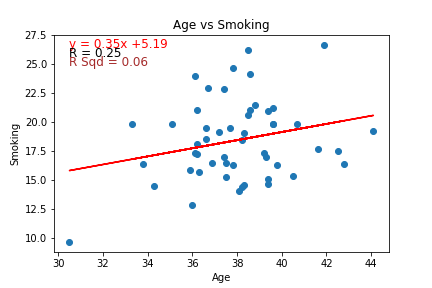
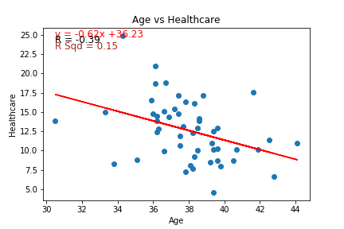
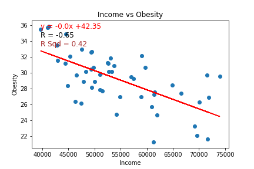
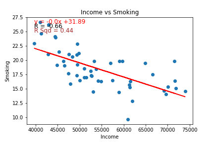
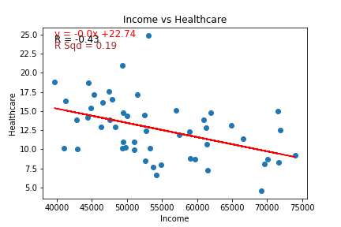

# D3 Challenge:

## This repository contains the folders and files regarding a D3exercise that was performed with data from the U.S. Census Bureau and the Behavioral Risk Factor Surveillance System. 

### Files and Folder Structure:
This repository contains the following:
1.	An HTML file called "index" which is the file used for the webpage.
2.	A folder called "assets". 
This folder contains the following subfolders:
* css: This folder contains:
*- 2 files related to styling / formatting.
* data: This folder contains:
*- A csv file called “data” that was provided to us – it has the data that we used for our analysis. 
*- A jupyter notebook file that we created to calculate correlations between certain combinations of data. 
*- The correlation graphs generated from the jupyter notebook file.
* Js: This folder contains”
*- The main javascript file called “app” that is used in the index.html file.

### Dataset Details:
The dataset provided to us in the csv file contained the following columns:
* Id
* Name of the State
* Abbreviation of the State
* Poverty 
* Poverty Margin of Error
* Age / Age Margin of Error
* Poverty / Poverty Margin of Error
* Income / Income Margin of Error
* Healthcare / Healthcare Low / Healthcare High
* Obesity / Obesity Low / Obesity High
* Smokes / Smokes Low / Smokes High

### Webpage Details:
We were asked to build a webpage containing a “dynamic scatter plot” with 3 labels on the X Axis (Poverty / Age / Income) and 3 labels on the Y Axis (Obesity / Smokes / Healthcare) that allows the user to select any combination of an X axis and a Y axis label, and see the scatter plot update automatically for the selected labels. 
 
 
The scatter plot displays 51 circles representing data for the 50 states and one Federal District (Washington D.C.) of the Unites States of America.Each circle represents the datapoints for the selected X Axis and Y Axis labels for a particular state. The abbreviation for each state is inside the relevant circle. For instance, TX in a circle represents the data for the state of Texas, CA in a circle represents data for the state of California, and so on. If you hover over any of the circles, you will see a pop up box that shows the full name of the State, and the data values for both, the selected X Axis and Y Axis Labels.

### Correlation Analysis:
We created a jupyter notebook that extracted the data from the csv file and calculated the correlations and the r-squareds for the different combinations of X Axis and Y Axis labels to understand the direction (positive or negative) and the strength of the relationships between these combinations. The results are as follows:
 
#### Poverty & Obesity: 
Correlation (R): 0.46
 
R-Squared: 0.21
  
Relationship: Positive (Upward Sloping)
 
Statistically Significant: No
 

#### Poverty & Smoking:               
Correlation (R): 0.52
 
R-Squared: 0.27
  
Relationship: Positive (Upward Sloping)
 
Statistically Significant: No
 

#### Poverty & HealthCare: 
Correlation (R): 0.52
 
R-Squared: 0.28
 
Relationship: Positive (Upward Sloping)
 
Statistically Significant: No
 

#### Age & Obesity:
Correlation (R): -0.01
 
R-Squared: 0.0
  
Relationship: None
 
Statistically Significant: N/A
 

#### Age & Smoking:
Correlation (R): 0.25
 
R-Squared: 0.06
 
Relationship: Positive (Upward Sloping)
 
Statistically Significant: No
 

#### Age & Healthcare:
Correlation (R): - 0.39
 
R-Squared: 0.15
 
Relationship: Negative (Downward Sloping)
 
Statistically Significant: No
 

#### Income & Obesity:
Correlation (R): - 0.65
 
R-Squared: 0.42
 
Relationship: Negative (Downward Sloping)
 
Statistically Significant: YES
 

#### Income & Smoking:
Correlation (R): - 0.66
 
R-Squared: 0.44
 
Relationship: Negative (Downward Sloping)
 
Statistically Significant: YES
 

#### Income & Healthcare:
Correlation (R): - 0.43
 
R-Squared: 0.19
 
Relationship: Negative (Downward Sloping)
 
Statistically Significant: No
 

